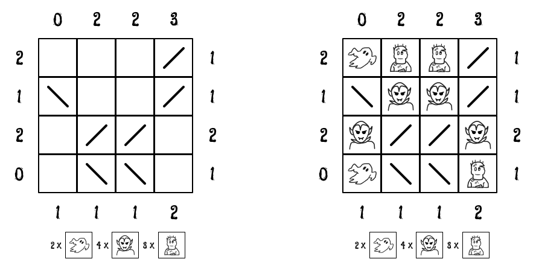

---   
title: Uncovering ghouls using Answer Set Programming
---

Recently I came across this nice puzzle - [Haunted](https://krazydad.com/haunted/). These days
my impulse when presented with puzzle is throw Answer Set Programming on it. To get idea
of ASP follow [this blog](./asp.html) which solves another puzzle which has somewhat
straightforward encoding in ASP.

A sample puzzle instance and its solution is shown above. In haunted you have to figure out 
where ghouls (ghosts, zombies and draculas) are hidding in rectangular grid. You can't
directly see ghosts but they are visible in mirrors. Draculas conceal themselves in mirrors but 
otherwise visible. Zombies have no such powers. You are also given count of each ghoul types
and how many of them are visible (counting multiplicity) from boundary locations. 

As per tradition, we encode instance and solution separately. First up instance of above puzzle

~~~{.default}
#const n = 4.

count(0, 1, 0). count(0, 2, 2). count(0, 3, 2). count(0, 4, 3).
count(1, 0, 2). count(2, 0, 1). count(3, 0, 2). count(4, 0, 0).
count(5, 1, 1). count(5, 2, 1). count(5, 3, 1). count(5, 4, 2).
count(1, 5, 1). count(2, 5, 1). count(3, 5, 2). count(4, 5, 1).

mirror(1, 4, "/").
mirror(2, 1, "\\"). mirror(2, 4, "/").
mirror(3, 2, "/"). mirror(3, 3, "/").
mirror(4, 2, "\\"). mirror(4, 3, "\\").

ghost(2). dracula(4). zombie(3).
~~~

We declare size of grid as constant `n`. `count(X, Y, N)` encodes relation that from `X`, `Y` coordinate
`N` number of ghouls are visible (Grid has been extended to include `0`th and `(n+1)`th row and column). 
`mirror(X, Y, T)` states the fact that there is mirror of type `T` at location `X`, `Y`. Finally number 
of each ghoul type is mentioned.

Next general solution as described below. First statement describes our grid. Next 3 statements place
ghouls on grid. For example `{ ghost(X, Y) : grid(X, Y) } = N :- ghost(N)` states that 
each grid location is valid placement for ghost though solution should only select as many as 
grid locations as there are ghosts. After this we add constraints that ghouls and mirrors don't 
occupy same place as well as two different kind of ghouls.

~~~{.default}
grid(X, Y) :- X = 1..n, Y = 1..n.

{ ghost(X, Y) : grid(X, Y) } = N :- ghost(N).
{ dracula(X, Y) : grid(X, Y) } = N :- dracula(N).
{ zombie(X, Y) : grid(X, Y) } = N :- zombie(N).

:- ghost(X, Y), mirror(X, Y, T).
:- dracula(X, Y), mirror(X, Y, T).
:- zombie(X, Y), mirror(X, Y, T).
:- ghost(X, Y), dracula(X, Y).
:- ghost(X, Y), zombie(X, Y).
:- dracula(X, Y), zombie(X, Y).

ghost(X, Y, N) :- count(X, Y, TN),
         N = #count { GX, GY, D : mirror_visible(X, Y, GX, GY, D), ghost(GX, GY) }.
dracula(X, Y, N) :- count(X, Y, TN),
         N = #count { DX, DY, D : direct_visible(X, Y, DX, DY, D), dracula(DX, DY) }.
zombie(X, Y, N1 + N2) :- count(X, Y, TN),
         N1 = #count { ZX, ZY, D : mirror_visible(X, Y, ZX, ZY, D), zombie(ZX, ZY) },
         N2 = #count { ZX, ZY, D : direct_visible(X, Y, ZX, ZY, D), zombie(ZX, ZY) }.

:- count(X, Y, N), ghost(X, Y, G), dracula(X, Y, D), zombie(X, Y, Z), N != G + D + Z.

#show ghost/2.
#show dracula/2.
#show zombie/2.
~~~

`ghost(X, Y, N)` inscribes that `N` ghosts are visible from boundary location `X`, `Y`. `N` is equal
to number of times we see ghosts in mirrors. Aggregate form `#count` counts number of elements in a set. 
In our case elements are tuple `GX`, `GY`, `D` where `GX`, `GY` is location of ghost which is visible from `X`, `Y`.
We need additional direction component `D` to account for multiple views of same ghoul by mirror reflections. 
Last component of `count/3` should be sum of last components of `ghost/3`, `dracula/3` and `zombie/3`
as mentioned as constraint. Notice that clingo (ASP implementation we are using) allows us to use same name for
relations with different arity. That's why a relation is mentioned by its name and arity like `ghost/2` in
show directive.
 
We haven't defined `mirror_visible` and `direct_visible` relations yet. It might be possible to
declare such relation in ASP declarative language, but I found it cumbersome to do so and used it as
opportunity to learn about clingo python scripting facility documented [here](https://potassco.org/clingo/python-api/5.6/).

We proceed in steps. First let us read instance file, store each statement in an array besides adding it to program 
we are currently evaluating.

~~~{.default}
statements = []
clingo.ast.parse_string(
   open("instance.lp").read(),
   lambda st: statements.append(st)
)

with clingo.ast.ProgramBuilder(ctl) as b:
   for st in statements:
      b.add(st)
~~~

Next we will find location of mirrors in grid by going through each rule and checking if its head starts with `mirror`.
If it is we will store arguments in `mirror_loc` - its location and type.

~~~{.default}
mirror_loc = []
for st in statements:
   if st.ast_type != clingo.ast.ASTType.Rule:
      continue
   ast_dict = clingox.ast.ast_to_dict(st)
   if ast_dict["head"]["atom"]["symbol"]["name"] != "mirror":
      continue
   arguments = ast_dict["head"]["atom"]["symbol"]["arguments"]
   arguments = map(lambda x: clingox.ast.dict_to_ast(x), arguments)
   r, c, t = map(lambda x: dict(x.items())["symbol"], arguments)
   mirror_loc.append(((r.number, c.number), t.string))
~~~

For each boundary location we trace path of light as it bounces off through mirrors storing which grid location it arrives at
via mirrors and which directly. Then we add appropriate relation - `direct_visible` or `mirror_visible`. When finding out
mirror location we have to deconstruct clingo AST, here we have to construct clingo AST which is done using `build_rule_ast` 
function. 

~~~{.default}
lookouts = itertools.chain.from_iterable(
   [[(0, i), (n+1, i), (i, 0), (i, n+1)] for i in range(1, n+1)])

for i, j in lookouts:
   direct, mirror = visibility(n, i, j, dict(mirror_loc))
   with clingo.ast.ProgramBuilder(ctl) as b:
      for (r, c, d) in direct:
         b.add(build_rule_ast(
                "direct_visible",
                [clingo.symbol.Number(i), clingo.symbol.Number(j),
                 clingo.symbol.Number(r), clingo.symbol.Number(c),
                 clingo.symbol.String(d)]))
      for (r, c, d) in mirror:
         b.add(build_rule_ast(
                "mirror_visible",
                [clingo.symbol.Number(i), clingo.symbol.Number(j),
                 clingo.symbol.Number(r), clingo.symbol.Number(c),
                 clingo.symbol.String(d)]))
~~~

Let's finally run our [program](https://gist.github.com/rdivyanshu/ea7d280767c7c68cffb94f1421813efa).

~~~{.default}
# clingo solution.lp

clingo version 5.6.2
Reading from solution.lp
Solving...
Answer: 1
zombie(1,2) zombie(1,3) zombie(4,4) dracula(2,2) dracula(2,3) dracula(3,1) 
dracula(3,4) ghost(1,1) ghost(4,1)
SATISFIABLE

Models       : 1+
Calls        : 1
Time         : 0.071s (Solving: 0.00s 1st Model: 0.00s Unsat: 0.00s)
CPU Time     : 0.071s
~~~
