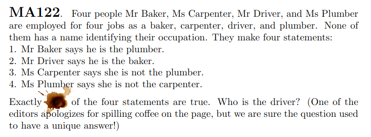

---   
title: Solving a mathemattic problem using Rosette
date-meta: 2021-06-30
description-meta: How to use solver aided language to solve a puzzle
---

Would n't it be interesting if programming language is aided with SMT solvers. [Rosette](https://docs.racket-lang.org/rosette-guide/index.html) is such language.
Using SMT solvers Rosette can [verify](https://docs.racket-lang.org/rosette-guide/ch_essentials.html#%28part._sec~3averify%29) that programs comply their specifications, [synthesis](https://docs.racket-lang.org/rosette-guide/ch_essentials.html#%28part._sec~3asynthesize%29) programs given specifications, find counter examples when program doesn't meet its specification and [solve puzzles](https://docs.racket-lang.org/rosette-guide/ch_essentials.html#%28part._sec~3asolve%29).

In this blogpost, I will be using Rosette to solve a puzzle which is taken from [Crux Volume 47, Issue 5](https://cms.math.ca/wp-content/uploads/2021/06/CRUXv47n5-b.pdf).

Let's fire up [Dr Racket](https://racket-lang.org/) where Rosette is available, give language directive to Racket and import a Rosette module.

~~~ {.racket}
#lang rosette
(require rosette/lib/angelic)
~~~

Next lets define all professions mentioned in the puzzle as elements of a list.

~~~ {.racket}
(define professions (list 'baker 'carpenter 'driver 'plumber))
~~~

Now we will assign professions to persons. But instead of traditional assignment, We will say profession of a person is any one within list.
`choose*` method from `angelic` module allows us to do this. A note on encoding I am using variables for persons and symbols for professions.

~~~ {.racket}
(define baker (apply choose* professions))
(define carpenter (apply choose* professions))
(define driver (apply choose* professions))
(define plumber (apply choose* professions))
~~~

Let us list down constraints (fixed) which are true. Each person has different profession and person name don't coincide with their profession.
Even though we have n't assigned profession to person in traditional sense, first constraint instructs that assigned values are all distinct.

~~~ {.racket}
(define (f-constraints)
  (list (distinct? baker driver carpenter plumber)
        (not (equal? baker 'baker))
        (not (equal? driver 'driver))
        (not (equal? carpenter 'carpenter))
        (not (equal? plumber 'plumber))))
~~~

Next note down constraints (variable) which may or may not hold as some statements might be false.

~~~ {.racket}
(define (v-constraints)
  (list (equal? baker 'plumber)
        (equal? driver 'baker)
        (! (equal? carpenter 'plumber))
        (! (equal? plumber 'carpenter))))
~~~

Before proceeding further we need helper method to find who is assigned given profession in solution once assignment is done by SMT solver.
`profession` is an element of `professions` and `sol` is solution returned by SMT solver. `evaluate` find assignement of variable
in solution.

~~~ {.racket}
(define (assigned profession sol)
  (first (filter (lambda (p) (equal? (evaluate p sol) profession))
          (list baker carpenter driver plumber))))
~~~

We are now at crux of our small program where we write function to fix assignment of person (variable) to profession (symbol) with help of SMT
solver which is invoked using [solve+](https://docs.racket-lang.org/rosette-guide/ch_syntactic-forms_rosette.html#%28def._%28%28lib._rosette%2Fquery%2Fform..rkt%29._solve%2B%29%29). First we will find assignment with constraint given as parameter. If no assignment exists due constraints being too restricting we return empty list else we try to find another solution where `driver` profession is not assigned to same person as first solution. If such assignment exists we return these two solutions in list otherwise we return only one solution in list.

~~~ {.racket}
(define (m-solve constraint)
  (define s-solve (solve+))
  (let ([sol (s-solve constraint)])
    (if (sat? sol)
        (letrec ([a-driver (assigned 'driver sol)]
                 [n-sol (s-solve (not (equal? 'driver a-driver)))])
            (cons sol (if (sat? n-sol) (list n-sol) (list))))
        (list))))
~~~

Finally let us solve the puzzle. We iterate through 0 to 4 assuming it is number of true statements which is anded with fixed constraints then asking for solution using `m-solve`. If only one solution exists we have found what we are looking for. Once we find that solution we ask profession assigned to each person. As you can see answer to our little puzzle is `baker`.

~~~ {.racket}
(define a-solutions 
    (filter (lambda (s) (= (length s) 1))
            (for/list ([t (range 5)])
                (m-solve 
                  (and (apply && (f-constraints))
                       (= t (length (filter identity (v-constraints)))))))))

(length a-solutions)
(define sol (first (first a-solutions)))
(evaluate (list baker carpenter driver plumber) sol)
~~~

~~~{.default}
Welcome to DrRacket, version 8.0 [cs].
Language: rosette, with debugging; memory limit: 128 MB.
1
'(driver plumber carpenter baker)
> 
~~~

Complete source code can be found [here](https://gist.github.com/rdivyanshu/41635e6d9075eac29e677dbfb025f18f).