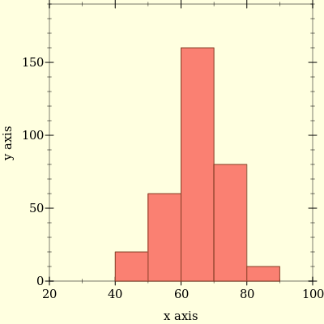

---   
title: A bit on Quantile Sketching
date-meta: 2023-04-16
description-meta: How to calculate percentiles without using too much memory ?
---

As part of production monitoring it is standard practice to measure `p95`, `p99` latencies. We also want to query
these metrics over dynamic time range. What is `p99` latency over last `3` hours? What is `p99` latency over last `5` minutes?

One option is calculate quantiles at client using [statsite](https://github.com/statsite/statsite) which will calculate 
configured quantiles for timer metrics over flush interval and then send data to monitoring servers for query. Quantiles 
statsite calculates is approximate to reduce memory footprint of statsite library. There are other issues with this approach 
besides quantiles being approximate.

- If configured quantiles are `p95` and `p99`, you can't query `p99.9`. When using this approach you need to know beforehand what quantiles you care about.
- It is not possible to find quantile over dynamic time range. Only quantile over flush interval will be right (within error bounds according to approximation algorithm).
- It is not possible to find `p99` latency, assuming `p99` is configured quantile, across all instances of service.

Reason for last two is there is no meaningful way to combine individual quantiles.

In following discussions I will assume that quantiles are calculated on servers of monitoring stack. To accurately calculate quantities
we can send all latencies data to server from application instances making heavy demand on storage and computation (at query time) on monitoring 
systems. This is unacceptable. To avoid it modern monitoring systems use quantile sketches which can calculate quantiles values within some error 
bounds by storing summary of data. 

Idea behind quantile sketching is clients will send out latency summary bucketed into bins with each bin measuring how many times latency falls within 
bounds of bucket. Using above data it is possible to find out in which bucket queried quantile will fall. After which linear interpolation can give point 
estimate of quantile. 

Let's go through steps to find `p95` from below histogram

- Our dataset contains `330` entries. If we sort our dataset the value at index `floor(q*(n-1))+1` is (Lower) q-quantile. Plugging values in formula we get 
  `p95` should be `313`th entry.
- `313`th entry lies in bucket `70`-`80`. Assuming uniform distribution, `313`th entry should be `70+(313-240)*(10/80)` which amounts to `79.12`, our `p95` estimate. 

### Mergeability
Querying over dynamic time range and over multiple instances requires mergeability - given multiple quantile sketches it should be possible 
to combine them to get overall quantiles. Using histograms mergeability requires bin boundaries are same so we can add corresponding bin counters 
to get combined quantile sketch.

### Error Bounds
In example above, point estimate of `p95` is `79.12`. Since it is estimate, it is better to get error bounds. As we don't have any insight into bins, it is possible that 
true `p95` lies anywhere between `70` (exclusive) and `80`. Relative error can be `13%` when true `p95` is near `70` and `1%` when it is `80`. Relative error of `p95` 
is bounded above by `13%`. Following table shows what is maximum relative error (in percentage) across quantiles which fall within that bucket. As you can see maximum relative error
varies across buckets. It is possible to design buckets such that maximum relative error is fixed. If buckets are log-based with `1.125` multiplier (`(1,1.125], (1.125,(1.125)^2] ...`)
then maximum relative error will be `12.5%` across buckets.

+-------------+-----------------------+
| Bucket      | Max  Relative Error % |
+=============+=======================+
| 40-50       | 25                    |
+-------------+-----------------------+
| 50-60       | 20                    |
+-------------+-----------------------+
| 60-70       | 16                    |
+-------------+-----------------------+
| 70-80       | 14                    |
+-------------+-----------------------+
| 80-90       | 12                    |
+-------------+-----------------------+

### Off the shelf sketches
Prometheus's default bucket configuration can be seen [here](https://github.com/prometheus/client_python/blob/v0.16.0/prometheus_client/metrics.py#L544). 
Notice that last bucket upper bound is `Inf`. If quantile falls into last bucket, it will return 10.0 as quantile estimate, lower bound of last bucket. It is
not possible to linear interpolate in last bucket as upper bound is `Inf`. As a result it is hard to find maximum relative error for last bucket. 
VictoriaMetrics divides `[10^(-9),10^18]` range into log based buckets with `10^(1/18)` multiplier [[github]](https://github.com/VictoriaMetrics/metrics/blob/v1.23.1/histogram.go#L11). This gives ability to capture 
wide range of observation (nanoseconds in time scale, million of terabytes in storage scale) with `13.6%` worst case relative estimate of quantile. HdrHistogram, DDSketch and 
Circllhist are other quantile sketches which are used in industry.

