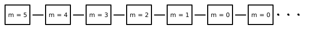
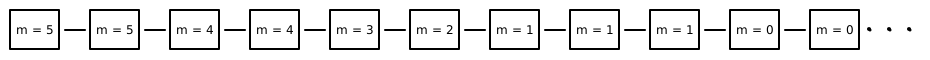

---   
title: Stuttering Steps and Temporal Formulas in TLA+
---

Let's say you want to specify Timer in `TLA+` which counts down `5` minutes of time.

~~~{.default}
---------------------------------MODULE TIMER --------------------------------------

EXTENDS Naturals

VARIABLE minutes

CHECK == minutes \in (0..5)

INIT == minutes = 5
NEXT == IF minutes > 0 
           THEN minutes' = minutes - 1
           ELSE minutes' = minutes

SPEC == INIT /\ [][NEXT]_<<minutes>>

====================================================================================
~~~

Code listed above shows `TLA+` specification for the same, assuming you want minutes to decrease by `1`
in single step until it reaches `0`. Ideally you want `SPEC` to be `INIT /\ []NEXT` representing 
system behavior as shown in figure. 

But alas `TLA+` doesn't allow it. It requires you to account for stuttering steps which forces you 
to change `SPEC` to  `INIT /\ [][NEXT]_<<minutes>>`. Some of system behavior satisfying `SPEC` is 
shown below.

Next you want to check temporal formula (property) that `eventually` minutes will be 0 `always`. You
add `PROP == <>` (`<>[]` means `eventually always`) to module and proceed to model 
check. `TLA+` model checker points out that temporal formula is not satisfiable and gives counterexample
system behavior - which stutters infinitely after counting down to `1`.

We will look into how to avoid this but for now let's explore why stuttering steps are enforced
in `TLA+`.

### Why stuttering steps are enforced ?

`TLA+` makes it easy to specify systems hierarchically. Suppose we have hierarchy of specifications 
$S_1$, $S_2$, ... , $S_n$ of a system where $S_1$ is high level specification and $S_n$ is low 
level specification. To connect between them we need to verify that $S_n$ is correct implementation 
(low level details) of high level specification $S_1$. This is done by showing that $S_2$ is refinement 
of $S_1$, $S_3$ is refinement of $S_2$ so on.

Let's look at concept of refinement through an example. Suppose you implemented Timer counting seconds.

~~~{.default}
-------------------------------- MODULE TIMER2 -------------------------------------

EXTENDS Naturals

VARIABLE minutes, seconds

CHECK == /\ /\ seconds \in (0..59) 
            /\ minutes \in (0..5)
         /\ minutes = 0 => seconds = 0

INIT == minutes = 5 /\ seconds = 0

DECRMINUTES == 
    /\ seconds = 59
    /\ minutes' = minutes - 1
    /\ seconds' = 0

INCRSECONDS ==
    /\ minutes > 0
    /\ seconds < 59
    /\ seconds' = seconds + 1
    /\ minutes' = minutes

NEXT == \/ DECRMINUTES
        \/ INCRSECONDS
        \/ /\ minutes = 0
           /\ minutes' = minutes
           /\ seconds' = seconds

SPEC == INIT /\ [][NEXT]_<<minutes, seconds>>

====================================================================================
~~~

To verify that `TIMER2` is refinement of `TIMER` we add following definition 
in `TIMER2` module and model check that `SPECIFICAION SPEC` implies `PROPERTY RSPEC`.

~~~{.default}
RTIMER == INSTANCE TIMER
RSPEC == RTIMER!SPEC
~~~

`TLA+` model checker validates refinement as success. Part of why refinement worked out without 
any ceremony is `TLA+` insisted about stuttering steps in high level specification. 
Through refinement we want to show that for every system  behavior of `TIMER2` there is corresponding 
system behavior of `TIMER` which can be shown by converting `INCRSECONDS` to stuttering steps of 
high level specification and hiding state of `seconds` (see illustrations).

### How to verify temporal formula ?

We say that system behaves not as specified by `INIT /\ [][NEXT]_<<minutes>>` but with a modification
- there can be finite but arbitrary large number of stuttering steps. `WF_minutes(NEXT)` is one of ways
of enforcing this - It is always case that if `NEXT` is enabled (system can take `NEXT` step) forever 
then `NEXT` must eventually happen.

We change system specification to `SPEC == INIT /\ [][NEXT]_<<minutes>> /\ WF_minutes(NEXT)` and model check 
`PROP` again. This time it succeeds.