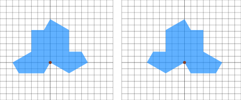
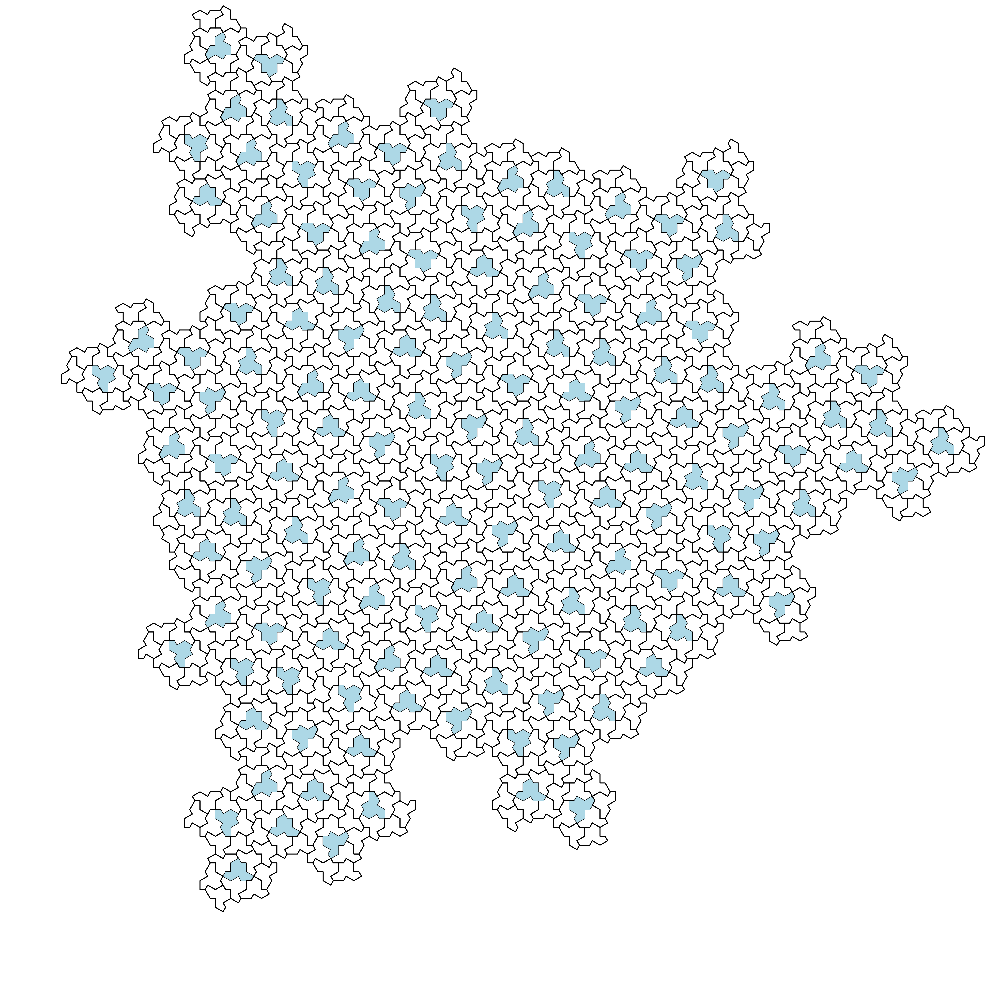

---   
title: Drawing hat tiling using Racket
date-meta: 2023-09-20
description-meta: Hats! Hats! Substitution tiling in racket
---

### Introduction  
 _Note: This blogpost is heavily inspired from [this wolfram community article](https://community.wolfram.com/groups/-/m/t/2858759)_. 

Whether a single geometrical shape exists that can tile plane aperiodically was open problem until recently. Since discovery of hat and related 
shapes we know answer is affirmative. In this blog we will draw tiling of plane using hat and its reflection. Hat is a ploykite with `13` components, 
`3` different edge lengths and interior angles multiples of `30` degree. Using metapict library, let's draw canonical hat and its reflection.  

~~~{.racket}
#lang racket
(require metapict)

(struct H-edge (turn) #:transparent)
(struct T1 H-edge ()  #:transparent)
(struct T2 H-edge ()  #:transparent)
(struct T3 H-edge ()  #:transparent)

(define hat
  (list (T1 -1) (T1 1) (T2 4) (T2 6) (T1 3)
        (T1 5) (T2 8) (T2 6) (T1 9) (T1 7)
        (T2 10) (T3 12) (T2 14)))

(define flipped-hat
  (list (T2 -2) (T3 0) (T2 2)
        (T1 5) (T1 3) (T2 6) (T2 4) (T1 7)
        (T1 9) (T2 6) (T2 8) (T1 11) (T1 1)))

(define (H-edge-length e)
  (cond
    [(T1? e)  (sqrt 12)]
    [(T2? e)         2]
    [(T3? e)         4]))

(define (scan init fn lst)
  (if (null? lst)
      (list init)
      (cons init
            (scan (fn init (first lst)) fn (rest lst)))))

(define (H-edges->curve origo turn edges)
  (let ([points (scan origo pt+
                      (map (lambda (e)
                             (pt@d (H-edge-length e)
                                   (* 30 (+ turn (H-edge-turn e)))))
                           edges))])
    (apply make-curve (append
                       (apply append (map (lambda (p) (list p --))
                                          (drop-right points 1)))
                       (list cycle)))))

(with-window (window -7 7 -7 7) (draw (H-edges->curve (pt 0 0) 0 hat)))
(with-window (window -7 7 -7 7) (draw (H-edges->curve (pt 0 0) 0 flipped-hat)))
~~~

When above code is run, it will draw shapes shown below minus grid and interior being colored blue.

### Substitution Tiling 

Larger and larger area of plane can be tiled using [substitution tiling](https://en.wikipedia.org/wiki/Substitution_tiling). In case of hat tiling, substitution is given in 
terms of metatiles `H`, `T`, `P` and `F`. Let's look at them and code used to draw them.  

~~~{.racket}
(struct M-edge (turn) #:transparent)

(struct X+ M-edge () #:transparent)
(struct X- M-edge () #:transparent)
(struct A+ M-edge () #:transparent)
(struct A- M-edge () #:transparent)
(struct B+ M-edge () #:transparent)
(struct B- M-edge () #:transparent)
(struct F+ M-edge () #:transparent)
(struct F- M-edge () #:transparent)
(struct  L M-edge () #:transparent)

(define meta-H
  (list (X+ 0)
        (B- 1) (X- 1)
        (X+ 2)
        (B- 3) (X- 3)
        (X+ 4)
        (A+ 5) (X- 5)))

(define meta-T
  (list (A- 0)
        (A- 2)
        (B+ 4)))

(define meta-P
  (list (X+ 0) (A- 0)
        ( L 2) (X- 2)
        (X+ 3) (B+ 3)
        ( L 5) (X- 5)))

(define meta-F
  (list (X+ 0) (L 0) (X- 0)
        (F+ 1)
        (F- 2)
        (X+ 3) (B+ 3)
        ( L 5) (X- 5)))

(define (M-edge-length e)
  (cond
    [(or (A+? e) (A-? e) (B+? e) (B-? e)) 12]
    [else 4]))

(define (M-edges->curve origo turn edges)
  (let ([points (scan origo pt+
                      (map (lambda (e)
                             (pt@d (M-edge-length e)
                                   (* 60 (+ turn (M-edge-turn e)))))
                           edges))])
    (apply make-curve (append
                       (apply append (map (lambda (p) (list p --))
                                          (drop-right points 1)))
                       (list cycle)))))

(with-window (window -20 20 -20 20) (draw (M-edges->curve (pt 0 0) 0 meta-H)))
(with-window (window -20 20 -20 20) (draw (M-edges->curve (pt 0 0) 0 meta-T)))
(with-window (window -20 20 -20 20) (draw (M-edges->curve (pt 0 0) 0 meta-P)))
(with-window (window -20 20 -20 20) (draw (M-edges->curve (pt 0 0) 0 meta-F)))
~~~

Notice that there is mismatch in number between edges in picture and code. Also there are two variants, 
positive and negative, of edge types (`X+`, `X-` etc) except `L`. Why such oddities will be clear when one
looks how hats are projected into these metatiles.

Edges of metatiles are deconstructed into parts and type and attribute (positive or negative) are given to them. Positive or 
negative label depends on whether parts of hats are bulging out or deflating in around metatile edges. Substitution rule should 
line up `A+` and `A-`, `B+` and `B-`, `X+` and `X-` so on. This is required so that no gap remains in tiling. Next let's look at 
substitution rules of metatile `H`, `T`, `P` and `F` respectively.

Since projection of hats in metatiles is not invariant under rotation but `3` metatiles are, substitution rule should also
specify orientation of metatiles. In our case this orientation is specified by local origin of metatile.

Up until now all our drawing is done at origin `(pt 0 0)` without rotation even though our methods `H-edges->curve` and
`M-edges->curve` can account for translation and rotation. To expand metatiles using substitution rule we will require translation
and rotation. We wrap our canonical drawing of metatiles in `p-meta` structure which includes rotation `turn` and translation
`dist`. Translation is not given as single vector but list of vectors each of which is given in terms of metatile edges `M-edge`. 
Idea is if we travel along these edges from origin we arrive at point which is local origin of wrapped metatile. Also notice 
that attributes (`+` / `-`) of `M-edge` does n't matter in translation vector as `+` and `-` of same type are always lined up. Replacing 
`X+` with `X-` (or any other such pairing) or vice versa makes no difference.

~~~{.racket}
(struct p-meta
  (meta turn dist) #:transparent)

(define meta-H~>
  (list (p-meta meta-H  0 (list (F- 1) (X+ 2) (B+ 2) (X- 1)))
        (p-meta meta-H -2 (list (F- 1) (X+ 2) (B+ 2) (X- 1)))
        (p-meta meta-H  0 (list (F- 1) (X+ 0) (B- 1) (X- 1)))
        (p-meta meta-T  0 (list (F- 1) (X+ 2) (B+ 2) (X- 1)
                                (X+ 0)))
        (p-meta meta-F -1 (list (F- 3) (X+ 2) (L 2) (X- 2)))
        (p-meta meta-F  1 (list (F- 1) (X+ 0) (B- 1) (X- 1)
                                (X+ 0) (L 0) (X- 0)))
        (p-meta meta-F  3 (list (F- 1) (X+ 2) (B+ 2) (X- 1)
                                (X+ 0) (B- 1) (X- 1) (X+ 2)
                                (L 2) (X- 2)))
        (p-meta meta-P  2 (list (F- 1) (X+ 2) (B+ 2) (X- 1)))
        (p-meta meta-P  1 (list (F- 1) (X+ 0) (L 0) (X- 0)))
        (p-meta meta-P  3 (list (F- 1) (X+ 0) (B- 1) (X- 1)
                                (X+ 0) (B- 1) (X- 1) (X+ 2)
                                (L 2) (X- 2)))))
~~~

Picture below shows how translation of `H` metatiles are calculated using `M-edges`. Notice that first and
second `H` metatile has same local origin. Second `H` metatile (bottom one) is rotated by `120` degree clockwise (`-2 * 60`). 

We now need to write `substitute-many` so that we can call it successively to get bigger and bigger substitution. To achieve this
we need substitution rules for `M-edges` for fixing `dist` which is given by `M-edge-reps`.

~~~{.racket}
(define (M-edge-reps e)
  (let ([turn (M-edge-turn e)])
    (cond
     [(A-? e) (list (B- turn) (X- turn) (X+ (+ turn 1)))]
     [(A+? e) (list (X- (+ turn 1)) (X+ turn) (B+ turn))]
     [(B-? e) (list (X- (+ turn 1)) (X+ turn) (A- turn))]
     [(B+? e) (list (A+ turn) (X- turn) (X+ (+  turn 1)))]
     [(F-? e) (list (X+ turn) (L turn) (X- turn) (F+ (+ turn 1)))]
     [(F+? e) (list (F- (+ turn 1)) (X+ turn) (L turn) (X- turn))]
     [(L? e)  (list (L (- turn 1)))]
     [(X-? e) (list (X- (- turn 1)) (X+ turn) (L turn) (X- turn) (F+ (+ turn 1)))]
     [(X+? e) (list (F- (+ turn 1)) (X+ turn) (L turn) (X- turn) (X+ (- turn 1)))])))

(define (turn-M-edge e t)
  (cond
    [(A-? e) (A- (+ t (M-edge-turn e)))]
    [(A+? e) (A+ (+ t (M-edge-turn e)))]
    [(B-? e) (B- (+ t (M-edge-turn e)))]
    [(B+? e) (B+ (+ t (M-edge-turn e)))]
    [(F-? e) (F- (+ t (M-edge-turn e)))]
    [(F+? e) (F+ (+ t (M-edge-turn e)))]
    [( L? e) ( L (+ t (M-edge-turn e)))]
    [(X-? e) (X- (+ t (M-edge-turn e)))]
    [(X+? e) (X+ (+ t (M-edge-turn e)))]))

(define (substitute pm)
  (let ([o-turn     (p-meta-turn pm)]
        [o-dist     (p-meta-dist pm)]
        [o-meta     (p-meta-meta pm)])
    (map
     (lambda (p) (struct-copy p-meta p
                              [turn (+ o-turn (p-meta-turn p))]
                              [dist (append (apply append (map M-edge-reps o-dist))
                                            (map (lambda (e) (turn-M-edge e o-turn))
                                                 (p-meta-dist p)))]))
     (cond
       [(eq? o-meta meta-H) meta-H~>]
       [(eq? o-meta meta-T) meta-T~>]
       [(eq? o-meta meta-P) meta-P~>]
       [(eq? o-meta meta-F) meta-F~>]))))

(define (substitute-many p-metatiles)
  (apply append (map substitute p-metatiles)))
~~~

We have all machinery ready for hat tiling. Code is listed [here](https://gist.github.com/rdivyanshu/2d71e604917aa4893a701ca7f71c67b4)
which also includes functions to project hats into metatiles, which is not covered here.  

